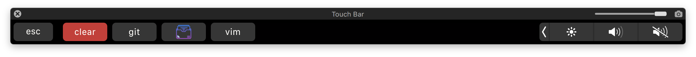
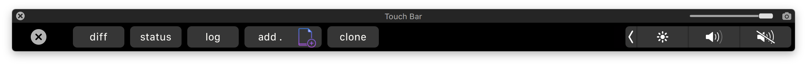

# Hyper Custom Touchbar

**hyper-custom-touchbar is a TouchBar plugin for [Hyper.app](https://hyper.is/)**. It replaces the TouchBar area with user-defined executable commands.

## Install

To install, edit `~/.hyper.js` and add `'hyper-custom-touchbar'` to `plugins`:

```javascript
module.exports = {
  ...
  plugins: ['hyper-custom-touchbar']
  ...
}
```


## Custom TouchBar Buttons

Following is what my shortcuts look like but feel free to change them as you like to better suit your development needs.

Add the following to `~/.hyper.js`

```javascript
module.exports = {
  config: {
    ...
      hyperCustomTouchbar: [
      {
        label: 'git',
        options: [
          { label: 'diff',  command: 'git diff' },
          { label: 'status',  command: 'git status' },
          { label: 'log',  command: 'git log' },
          { label: 'add .',  command: 'git add .' },
        ]
      },
      {
        label: 'cd',
        options: [
          { label: 'nginx', command: 'cd /usr/local/etc/nginx' },
          { label: 'log', command: 'cd /usr/local/var/log' },
        ]
      },
      {
        label: 'vim',
        options: [
          { label: 'quit', command: ':q!', esc: true },
          { label: 'save & quit', command: ':x', esc: true },
        ]
      },
    ]
    ...
  }
}
```





## License
This project is licensed under the MIT License - see the [LICENSE](LICENSE) file for details
